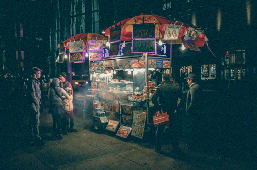
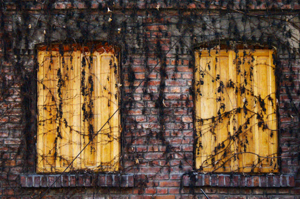
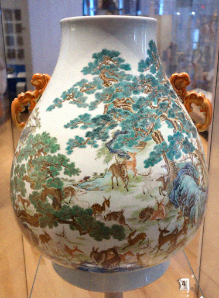
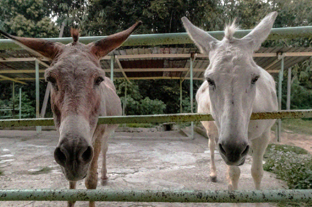
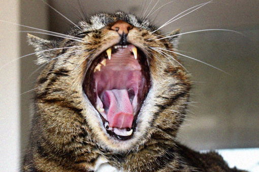
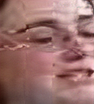

# RSR

| LR | HR (Upscale4x) |
| ------------- | ------------- |
| | |
| |  |
| |  |
| |  |
| |  |
| |  |
| |  |
| |  |
| |  |
| |  |

##TineFace

| LR | HR (Upscale4x) |
| ------------- | ------------- |
| |
| | |
| | |
| | |
| | |

